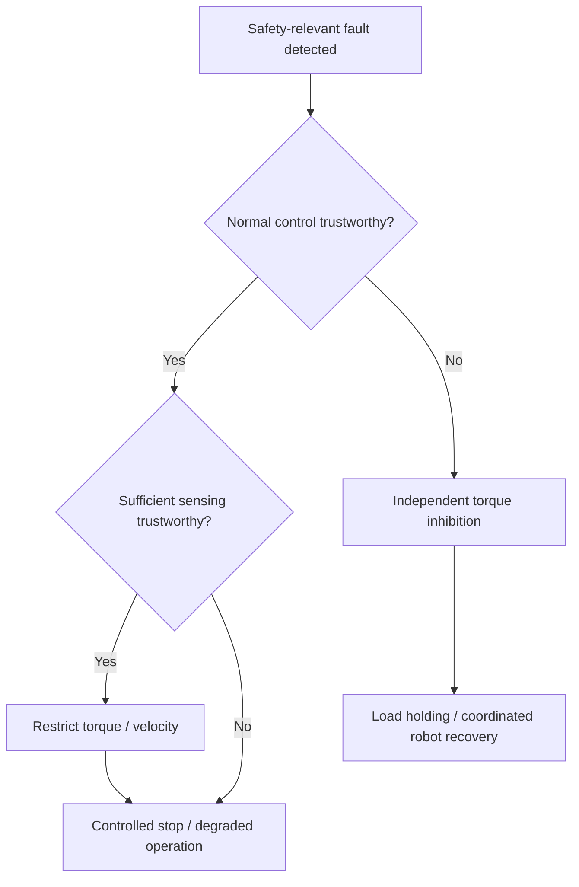

# Humanoid Knee Joint Safety Architecture

## Requirements-to-Verification Safety Demonstrator

Safety analysis and architecture study for one load-bearing knee joint of an industrial humanoid robot.

# 1. System Definition

## 1.1 Purpose

This project looks at one load-bearing knee joint of an industrial humanoid robot.

The joint has to convert a motion or torque request from the robot controller into controlled knee movement, while still being able to detect local faults and react before they develop into hazardous motion.

The aim is not to design the complete humanoid robot, but to understand how requirements, architecture, diagnostics and fault reactions can be built around one safety-critical actuator.

## 1.2 System Boundary

The system under consideration is the complete local knee-joint actuation chain.

Included inside the boundary:

- Communication interface
- Local joint controller
- Motor-control function
- Gate driver
- Three-phase inverter
- PMSM motor
- Reduction gearbox / transmission
- Motor encoder
- Joint-output encoder
- Motor-current sensing
- Voltage and temperature monitoring
- Local safety monitoring
- Independent torque-disable path
- Provision for an independent load-holding mechanism / joint brake, if required by the final safety concept

The physical joint output is included because the safety concern is not only what the electronics command, but what the knee actually does.

## 1.3 External Systems

The knee system interacts with the following robot-level systems.

**Whole-Body Motion Controller.** Provides the requested joint behavior, for example desired joint position, velocity, torque, operating mode and enable / disable request. It is outside the knee system boundary because it coordinates the complete robot rather than only the knee.

**Robot Safety Supervisor.** Coordinates robot-level reactions such as controlled stop, degraded operation, posture recovery and higher-level power isolation. The knee system reports fault and health status to this supervisor.

**Robot Power System.** Provides the actuator DC supply. For this demonstrator, a nominal actuator DC bus of approximately 48 V is assumed.

**Robot Mechanical Structure and Environment.** The knee is connected to the thigh and lower leg and is influenced by robot weight, payload, inertia, ground-reaction forces, disturbances from other joints and contact with the environment. These loads are treated as external inputs to the knee system.

## 1.4 Main Inputs

The knee system receives:

- Desired joint position
- Desired joint velocity
- Desired joint torque
- Mode / enable command
- DC electrical power
- Mechanical load at the joint
- Robot-level safety requests

Local sensor feedback is treated as an internal input to the control and safety functions.

## 1.5 Main Outputs

The system produces:

- Knee joint torque
- Knee joint angular motion
- Actual joint position and velocity
- Actuator status
- Diagnostic information
- Detected fault status
- Degraded-operation / safety-reaction status

## 1.6 Functional Chain

The nominal control path is:

`Whole-Body Controller -> Communication Interface -> Local Joint Controller -> Motor Control -> Gate Driver -> 3-Phase Inverter -> PMSM Motor -> Gearbox -> Knee Joint Output`

The corresponding energy path is:

`Robot Power System -> DC Bus -> Inverter -> Motor -> Gearbox -> Knee Joint`

The feedback path includes the motor encoder, joint encoder, current sensing, voltage sensing and temperature sensing. These signals are used by both the normal control path and the safety-monitoring path.

## 1.7 Operating Scenario Used in This Project

The reference scenario is a humanoid walking slowly near a person while carrying a load. The knee is load-bearing and contributes to maintaining posture and controlled forward motion.

A fault causes the knee to move faster than intended or produce unintended / excessive torque. Possible consequences include:

- Loss of controlled walking
- Collision with the nearby person
- Loss of balance or robot fall
- Dropped or destabilised payload
- Damage to the robot or nearby equipment

This scenario is used throughout the hazard analysis, FMEA, FTA and verification concept.

## 1.8 Important Safety Assumption

Immediate torque removal is not assumed to be safe by default for a load-bearing knee.

`Torque removal -> loss of knee support -> possible robot collapse`

The required fault reaction therefore depends on which control functions remain trustworthy after the fault.

Where normal control can no longer be trusted, torque inhibition may need to be combined with an independent means of maintaining or safely removing the joint load, such as a holding brake or coordinated robot-level support.

The detailed holding mechanism is not designed in this demonstrator.

## 1.9 Initial Design Assumptions

1. The actuator uses a PMSM motor and a three-phase inverter.
2. A mechanical reduction stage is present between the motor and the knee output.
3. Motor position and joint-output position are measured separately.
4. Motor current is measured and available for control and diagnostics.
5. The local knee controller cannot assume that commands from the whole-body controller are always correct.
6. Safety monitoring includes absolute actuator limits or a permitted operating envelope and therefore does not rely only on commanded-versus-measured deviation.
7. The safety-monitoring function should not rely completely on the same control path that may create the hazardous behavior.
8. A single sensor fault should not automatically result in unrestricted actuator operation.
9. Mechanical faults remain part of the safety analysis even if they cannot be fully mitigated electronically.

## 1.10 Out of Scope

The following are not developed in detail:

- Complete humanoid balance control
- Gait planning
- Perception / AI safety
- Battery-pack safety
- Full robot structural analysis
- Cybersecurity
- Detailed design and sizing of the load-holding / brake mechanism
- Full certification assessment
- Detailed motor electromagnetic design

These may appear as external interfaces or assumptions, but they are not the focus of this demonstrator.

# 2. System Architecture

## 2.1 Architecture Objective

The knee-joint architecture is developed around one main safety concern: unintended or excessive knee torque or motion while the joint is load-bearing.

The architecture supports normal closed-loop actuator control together with local monitoring and fault reaction.

A key design objective is that the same control path that can create hazardous torque should not be the only means available to detect or mitigate it.

Detailed circuit design, processor selection, motor electromagnetic design and production-level redundancy are outside the current scope.

## 2.2 Architecture Overview

The architecture contains four main paths:

- command and control
- electrical and mechanical energy flow
- sensor feedback and diagnostics
- safety monitoring and fault reaction

The command path defines the requested actuator behaviour.

The energy path converts electrical power into physical knee torque and motion.

The feedback path provides information about the actual actuator state.

The safety path checks whether actuator behaviour remains within the expected and permitted operating envelope and initiates a reaction when required.

## 2.3 Command and Control Path

The normal command path is:

`Whole-Body Motion Controller → Communication Interface → Local Joint Controller → Motor Control / FOC → Gate Driver → Inverter`

The Whole-Body Motion Controller provides the required joint-level motion intent.

The Local Joint Controller executes this request subject to local limits and diagnostics.

Motor Control / FOC regulates motor current and generates PWM for the inverter.

**Allocation decision:** whole-body motion planning remains at robot level, while fast actuator execution, monitoring and local limitation remain within the knee system.

The local safety concept does not assume that every upstream command is correct.

## 2.4 Energy and Mechanical Actuation Path

The physical energy path is:

`Robot Power System → DC Bus → Three-Phase Inverter → PMSM Motor → Reduction Gearbox → Knee Joint`

This is the physical hazard-propagation path.

Faults in the power stage, motor or transmission can cause actual joint behaviour to differ from the intended behaviour. Monitoring software commands alone is therefore not sufficient.

## 2.5 Feedback and Diagnostic Path

The architecture uses measurements from several physical points in the actuator.

| Signal | Used by | Architectural purpose |
| --- | --- | --- |
| Joint encoder | Local Controller, Safety Monitor | Actual knee motion |
| Motor encoder | Motor Control / FOC, Safety Monitor | Rotor state and motor-side motion |
| Motor current | Motor Control / FOC, Safety Monitor | Electrical actuation / torque indication |
| Voltage / temperature | Controller, Safety Monitor | Operating-condition supervision |

Some signals are used by both normal control and safety monitoring. This alone does not provide sensor independence.

Where the same sensor contributes to both functions, common sensor faults remain possible and must be considered in the safety analysis.

## 2.6 Cross-Monitoring Concept

Measurements from different physical points are compared to detect inconsistent actuator behaviour.

One example is:

`Motor Encoder ↔ expected transmission relationship ↔ Joint Encoder`

A mismatch may indicate:

- gearbox or coupling fault
- motor encoder fault
- joint encoder fault
- incorrect scaling or configuration

The check identifies that actuator behaviour is inconsistent; it does not necessarily identify which element has failed.

A similar check is used in the electrical path:

`Commanded Motor Current ↔ Measured Motor Current`

A persistent difference indicates that the electrical actuation path is not following the requested behaviour.

Cross-monitoring improves fault detection but does not by itself guarantee fault isolation or sensing independence. Additional sensing diversity may be required in a production design.

## 2.7 Safety Monitor

The Safety Monitor supervises selected safety-relevant relationships independently of the primary motion-control objective.

The main monitoring functions are:

- commanded-versus-measured joint-velocity monitoring
- commanded-versus-measured motor-current monitoring
- motor-to-joint transmission plausibility
- communication supervision
- sensor plausibility
- controller / timing supervision
- absolute actuator safety-envelope monitoring

The last function is important because command-to-response monitoring alone cannot detect an unsafe command that is executed correctly.

The Safety Monitor therefore also supervises command-independent limits such as:

- maximum permitted joint velocity
- permitted joint-position range
- maximum permitted torque / torque-producing current

The exact limits are not yet derived.

The Safety Monitor is not intended to be a duplicate joint controller. Its purpose is to reduce the possibility that one control-path failure can both create hazardous behaviour and prevent its detection.

The required implementation independence remains an open design item.

## 2.8 Independent Fault-Reaction Path

The architecture includes a hardware-capable path for inhibiting hazardous torque without relying solely on the normal control software.

For example:

`Local Joint Controller Fault → incorrect current request → hazardous motor torque`

If the same failed controller is also required to execute the only available shutdown command, the safety reaction contains a single dependency.

The independent path must therefore be capable of influencing torque generation separately from the normal controller.

For a load-bearing knee, torque inhibition alone may not provide a complete safe reaction. Loss of actuator torque can remove joint support and lead to collapse.

The final safety concept may therefore require torque inhibition to be combined with an independent load-holding mechanism or coordinated robot-level support.

The detailed hardware implementation is not defined in this demonstrator.

## 2.9 Robot-Level Safety Supervisor

Local actuator faults and degraded states are reported to the Robot Safety Supervisor.

The knee system is responsible for fast local detection and actuator-level reaction.

The Robot Safety Supervisor coordinates whole-body actions such as:

- posture recovery
- coordinated stopping
- degraded whole-body operation
- higher-level power isolation

This separation reflects the different information available at each level: the knee system has detailed actuator information, while the robot-level supervisor has the context required to coordinate the complete robot.

## 2.10 Fault-Reaction Philosophy

The fault reaction depends on which functions remain trustworthy after the fault.

If normal control remains trustworthy, possible reactions include:

- torque limitation
- velocity limitation
- degraded operation
- controlled stop

If normal control cannot be trusted, the reaction may require:

- independent torque inhibition
- power isolation
- independent load holding
- coordinated robot-level recovery

The guiding principle is:

**Use the least disruptive reaction that still provides a trustworthy means of controlling the hazard.**

## 2.11 Key Architecture Decisions

The main architecture decisions are:

- Whole-body motion planning remains outside the local knee boundary.
- Fast actuator execution and monitoring remain local to the knee.
- Motor-side and joint-side motion are measured separately.
- Motor current is treated as safety-relevant feedback.
- Safety monitoring includes both deviation monitoring and command-independent absolute limits.
- Safety monitoring is separated conceptually from normal control.
- Immediate torque removal is not treated as the universal safe reaction.
- Mechanical transmission faults remain part of the safety analysis.

## 2.12 Assumptions and Open Points

The following items require further development:

- PMSM and three-phase inverter are assumed as the actuator technology.
- Approximately 48 V is used as a representative actuator DC bus, not as a derived requirement.
- The required independence of the Safety Monitor is not yet defined.
- The detailed implementation of the independent torque-inhibit path is not specified.
- The load-holding / brake concept requires further definition and sizing.
- Diagnostic thresholds and reaction-time budgets are not yet derived.
- Sensor independence and diversity require further analysis.
- Quantitative diagnostic coverage and reliability targets are not yet calculated.
- Common-cause and dependent failures between control and safety paths require separate analysis.
Detailed common-cause and dependent-failure analysis remains future work.

# 3. Hazard Analysis

## 3.1 Purpose

This analysis identifies the hazardous behaviour associated with unintended knee-joint actuation during load-bearing operation.

The selected safety concern is:

**Unintended or excessive knee torque / motion while the joint is load-bearing.**

## 3.2 Operating Scenario

The reference operating scenario is:

**The humanoid robot is walking slowly near a person while carrying a load.**

During this operation:

- the knee is load-bearing
- the robot is moving relative to the person
- the carried load increases the mechanical consequence of a fault
- knee torque is required for both motion and posture control

## 3.3 Malfunctioning Behaviour

The malfunctioning behaviour considered is:

**The knee produces unintended or excessive torque, or moves with a velocity inconsistent with the intended joint behaviour.**

This can result from either an incorrect command or a failure within the local actuation chain.

## 3.4 Hazardous Event — HE-01

**HE-01 — Unintended or excessive knee motion occurs while the humanoid is load-bearing and operating close to a person.**

The unexpected knee behaviour may cause loss of controlled walking or posture.

Possible consequences include:

- collision with the nearby person
- loss of balance
- robot fall
- destabilisation or dropping of the carried load
- impact of the robot or payload with surrounding equipment

The actual consequence depends on robot mass, payload, joint velocity and the surrounding environment.

## 3.5 Possible Initiating Causes

Representative initiating causes include:

- missing, stale or corrupted robot-level command
- incorrect command generated by the local controller
- joint encoder or motor encoder fault
- incorrect motor-current feedback
- motor-control / PWM fault
- gate-driver or inverter fault
- gearbox or coupling fault
- incorrect scaling or configuration
- failure of a safety-monitoring or fault-reaction function

These causes are developed further in the FMEA and FTA.

## 3.6 Hazard Analysis Summary

| Field | Description |
| --- | --- |
| Operating situation | Humanoid walking slowly near a person while carrying a load. Knee is load-bearing. |
| Malfunctioning behaviour | Knee produces unintended / excessive torque or motion outside the intended behaviour. |
| Hazardous event | Unintended or excessive knee motion while load-bearing and close to a person. |
| Potential consequence | Collision, fall, dropped or destabilised load, injury to a person, or damage to the robot / equipment. |
| Possible causes | Communication, controller, sensor, motor-control, inverter, transmission or safety-mechanism fault. |
| Required safety measures | Command-independent motion limits, command-versus-response monitoring, sensor plausibility, communication supervision and an independent fault-reaction path. |
| Safe-reaction consideration | Torque removal may remove knee support; torque inhibition and load holding therefore need to be considered separately. |

## 3.7 Safety Goal — SG-01

From HE-01, the following high-level safety goal is defined:

**SG-01 — The knee joint system shall prevent or limit unintended or excessive joint torque during load-bearing operation such that hazardous uncontrolled knee motion is avoided.**

## 3.8 Safe-Reaction Consideration

Immediate torque removal is not treated as the universal safe reaction.

For a load-bearing knee:

`Torque removal → loss of knee support → possible robot collapse`

If normal control remains trustworthy, possible reactions include:

- torque or velocity limitation
- degraded operation
- controlled stop

If normal control cannot be trusted, an independent torque-inhibit path may be required.

In that case, the robot may also require an independent means of maintaining or safely removing the joint load, such as a holding brake or coordinated robot-level support.

The final reaction depends on the fault and the functions that remain trustworthy.

## 3.9 Provisional Risk Assessment

A provisional ISO 13849-style S/F/P assessment is used for the reference scenario.

The following assumptions are made for this demonstrator:

| Parameter | Assumption | Reasoning |
| --- | --- | --- |
| Severity — S | S2 | Uncontrolled motion of a load-bearing humanoid near a person could result in serious injury. |
| Frequency / exposure — F | F1 | Human exposure is assumed to be task-limited rather than continuous. |
| Possibility of avoidance — P | P2 | Avoidance may be difficult once unexpected robot motion has started. |

Under these assumptions, the preliminary result is:

**PLr d**

This result is provisional and depends strongly on the exposure assumption.

If human exposure is frequent or prolonged rather than task-limited, the required performance level may increase and must be reassessed.

## 3.10 Scope and Limitations

The analysis does not yet include:

- derived joint torque and velocity safety limits
- quantitative fault-tolerant time or reaction-time budget
- validated human-exposure assumptions
- quantitative reliability or diagnostic-coverage calculations
- ISO 13849 category / achieved PL calculation
- common-cause failure scoring
- detailed holding-brake design

# 4. Safety Requirements

## 4.1 Purpose

The safety requirements are derived from hazardous event HE-01 and safety goal SG-01.

They define the main monitoring, fault-detection and fault-reaction functions required at the knee-joint level.

Numerical limits and reaction times are not fixed yet. They will need to be derived from actuator dynamics, load cases, the permitted operating envelope and the available time to control the hazard.

## 4.2 Requirement Derivation Approach

The requirements were derived from the main ways HE-01 can develop through the command, sensing, control and actuation paths.

The concept therefore uses both:

- command-versus-response monitoring
- command-independent safety limits

This distinction is important because an unsafe command can be executed correctly without creating a command-to-response deviation.

## 4.3 Functional Safety Requirements

### FSR-01 — Joint Velocity Deviation Monitoring

The knee joint system shall monitor the deviation between commanded joint velocity and measured joint velocity.

A fault shall be detected when the deviation exceeds `V_DEV_MAX` for longer than `T_VEL_PERSIST`.

**Rationale:** A significant deviation indicates that the physical knee response is no longer following the requested motion.

### FSR-02 — Reaction to Excessive Velocity Deviation

Following detection of an excessive joint-velocity deviation, the knee joint system shall initiate the applicable safety reaction within `T_REACT_MAX`.

The reaction shall prevent continued unrestricted hazardous joint motion.

**Rationale:** Detection must be followed by a sufficiently fast reaction to prevent the deviation developing into hazardous motion.

### FSR-03 — Fault Reporting

The knee joint system shall report detected safety-relevant faults and degraded operating states to the Robot Safety Supervisor.

**Rationale:** Local detection may require coordinated whole-body action such as stopping, posture recovery or higher-level power isolation.

### FSR-04 — Motor Current Monitoring

The knee joint system shall monitor the deviation between commanded motor current and measured motor current.

A fault shall be detected when the deviation exceeds `I_DEV_MAX` for longer than `T_CURR_PERSIST`.

**Rationale:** Motor current provides information about the electrical torque-generation path. A significant deviation can indicate loss of normal torque control.

### FSR-05 — Reaction to Excessive Current Deviation

Following detection of a safety-relevant motor-current deviation, the knee joint system shall initiate the applicable safety reaction within `T_REACT_MAX`.

The reaction shall prevent continued unrestricted hazardous torque generation.

**Rationale:** If measured current no longer follows the requested current, normal torque control cannot automatically be assumed to remain trustworthy.

### FSR-06 — Transmission Plausibility Monitoring

The knee joint system shall monitor the relationship between motor-side motion and joint-side motion.

A fault shall be detected when the measured behaviour deviates from the expected transmission relationship beyond the defined plausibility limits.

**Rationale:** Motor-side and joint-side motion should remain physically consistent through the transmission. A mismatch may indicate a sensor, gearbox, coupling or configuration fault.

### FSR-07 — Communication Supervision

The knee joint system shall detect missing, delayed, corrupted or stale safety-relevant commands received from the Whole-Body Motion Controller.

**Rationale:** The local knee system cannot assume that every received command is valid and current.

### FSR-08 — Reaction to Communication Fault

Following detection of invalid or unavailable safety-relevant communication, the knee joint system shall prevent unrestricted continuation of normal operation and initiate the applicable degraded or safety reaction.

**Rationale:** Loss of trustworthy robot-level commands requires the local joint to move to a bounded operating condition.

### FSR-09 — Independent Safety Reaction Path

The knee joint system shall provide a hardware-capable safety reaction path that does not rely solely on the normal control software.

A single fault in the normal control path shall not prevent the safety reaction path from inhibiting hazardous torque generation.

**Rationale:** A fault in the normal controller must not also remove the only available means of mitigating the resulting hazardous actuation.

### FSR-10 — Sensor Fault Handling

When a safety-relevant sensor is detected as invalid or unavailable, the knee joint system shall prevent unrestricted actuator operation.

The subsequent reaction shall depend on the remaining trustworthy sensing and control capability.

**Rationale:** A single sensor fault does not always require immediate torque removal, but operation must remain bounded by the information that is still considered valid.

### FSR-11 — Independent Safety Envelope Monitoring

The knee joint system shall independently monitor whether measured joint motion and torque-related actuation remain within the permitted safety envelope.

The monitored limits shall include, where applicable:

- maximum permitted joint velocity
- permitted joint-position range
- maximum permitted torque or torque-producing current

Exceeding a safety-envelope limit shall initiate the applicable safety reaction.

**Rationale:** Command-versus-response monitoring cannot detect an unsafe command that is executed correctly.

### FSR-12 — Safety Mechanism Supervision

The knee joint system shall detect loss, unavailability or detected malfunction of the Safety Monitor or independent torque-inhibit path.

Unrestricted operation shall not be permitted while a required safety mechanism is unavailable.

**Rationale:** A latent failure in the safety path could otherwise remain undetected until another fault creates hazardous actuator behaviour.

## 4.4 Timing Constraint

The total safety reaction shall satisfy:

`T_DETECT + T_DECIDE + T_ACTUATE + T_PHYSICAL < T_HAZARD`

where:

- `T_DETECT` — fault-detection time
- `T_DECIDE` — safety logic processing time
- `T_ACTUATE` — time for the safety mechanism to act
- `T_PHYSICAL` — time for joint torque or motion to respond
- `T_HAZARD` — available time before the motion becomes hazardous

The numerical timing budget is still to be derived.

## 4.5 Parameters to Be Derived

| Parameter | Meaning |
| --- | --- |
| `V_DEV_MAX` | Maximum permitted commanded-to-measured velocity deviation |
| `I_DEV_MAX` | Maximum permitted commanded-to-measured current deviation |
| `T_VEL_PERSIST` | Persistence time for velocity-deviation detection |
| `T_CURR_PERSIST` | Persistence time for current-deviation detection |
| `V_SAFE_MAX` | Maximum permitted safety-monitored joint velocity |
| `Q_MIN / Q_MAX` | Permitted joint-position range |
| `TQ_SAFE_MAX` | Maximum permitted joint torque / torque-related actuation |
| `T_COMM_MAX` | Maximum permitted communication age / timeout |

# 5. FMEA and Fault Tree Analysis

This section examines how faults in the knee-joint architecture can contribute to HE-01: hazardous unintended knee motion while the joint is load-bearing.

The analysis focuses on failure paths that can create hazardous actuator behaviour, prevent its detection, or prevent the intended safety reaction.

## 5.1 Analysis Scope

The analysis covers failures across:

- sensing
- communication
- local control
- motor control and power electronics
- mechanical transmission
- safety monitoring
- fault-reaction functions

A failure mode is included when it can contribute directly to HE-01 or reduce the ability to detect or mitigate it.

## 5.2 FMEA Method

The focused FMEA uses the following reasoning chain:

**Failure Mode → Effect on Joint / System → Detection → Fault Reaction**

The analysis concentrates on how each failure can influence physical knee behaviour and which monitoring or reaction mechanism is intended to interrupt the fault propagation.

## 5.3 FMEA Observations

- A sensor fault can remain hazardous even when the reported value is still plausible.
- Shared sensing between control and monitoring can create common dependencies.
- Motor-side and joint-side encoders support useful plausibility checking across the transmission, but a mismatch does not necessarily identify which element has failed.
- Incorrect current feedback can cause actual torque to differ from the intended torque.
- A controller failure is more critical when the same controller is also required to execute the only available safety reaction.
- Power-stage faults can cause physical torque to differ from software intent.
- An unsafe command may be executed correctly, so command-versus-response monitoring alone is not sufficient.
- Mechanical transmission faults remain safety-relevant even when the electrical control path operates correctly.
- The Safety Monitor and independent torque-inhibit path must themselves be supervised for latent failures.

## 5.4 Fault Tree Analysis Approach

The FTA starts from HE-01 and works backward toward the main combinations of failures that can produce the hazardous event.

The tree is qualitative and intentionally simplified. It is used to show the main safety argument rather than calculate a top-event probability.

## 5.5 Fault Tree Structure

The top event, HE-01, is represented by:

**Hazardous actuator behaviour AND failure of the available safety mitigation**

Hazardous actuator behaviour may result from:

- incorrect command or control output
- motor-control or inverter fault
- incorrect encoder or current feedback

Safety mitigation failure may result from:

- failure of the Safety Monitor to detect the unsafe condition
- failure of the independent torque-inhibit path to stop hazardous torque

## 5.6 Dependent and Common-Cause Failures

The top-level AND gate represents the intended safety concept, but it does not by itself prove independence between the control and safety paths.

A common fault such as shared power, clock, processor resources or communication infrastructure could affect both the initiating path and the safety mechanism.

These dependent and common-cause failures are not fully developed in the simplified tree and require separate analysis as the architecture becomes more detailed.

## 5.7 FTA Logic and Interpretation

The initiating faults on the left are connected by an **OR** gate because any one may produce hazardous actuator behaviour.

The mitigation failures on the right are also connected by an **OR** gate.

The top-level **AND** gate shows the intended safety argument: an actuator fault should not lead to HE-01 if the safety mechanisms detect and control it successfully.

Communication and transmission faults are covered in the FMEA but are not shown as separate basic events in this simplified fault tree.

## 5.8 Link to Safety Requirements

The FMEA and FTA support the requirements derived in Section 4:

- FSR-01 / FSR-02 address joint-velocity deviation and the required reaction.
- FSR-04 / FSR-05 address motor-current deviation and torque-generation faults.
- FSR-06 addresses inconsistency between motor-side and joint-side motion.
- FSR-07 / FSR-08 address invalid or unavailable robot-level commands.
- FSR-09 provides a safety-reaction path that does not rely solely on normal control.
- FSR-10 addresses invalid or unavailable safety-relevant sensing.
- FSR-11 addresses unsafe actuator behaviour that may still be consistent with the commanded value.
- FSR-12 addresses loss or unavailability of the Safety Monitor or independent torque-inhibit path.

## 5.9 Limitations

This is a qualitative system-level analysis.

It does not yet include:

- component failure-rate or FIT data
- quantitative diagnostic coverage
- safe / dangerous failure classification
- achieved PL calculation
- quantitative top-event probability
- detailed common-cause failure analysis
- complete latent-fault analysis
- detailed failure analysis of the load-holding mechanism

# 6. Safety Concept, Traceability and Verification

## 6.1 Purpose

This section defines the fault-reaction concept and links the safety requirements to architecture and verification.

The safety focus remains:

**HE-01 — Hazardous unintended knee motion while the joint is load-bearing.**

The concept traces back to SG-01 and FSR-01 to FSR-12.

## 6.2 Safety Concept and Fault-Reaction Logic

The required reaction depends on which parts of the actuator remain trustworthy after a fault.

If normal control and sufficient sensing remain trustworthy, the system can use controlled torque or velocity limitation and move toward a controlled stop.

If the normal control path can no longer be trusted, the reaction must use a mechanism that does not depend solely on that path.

For a load-bearing knee, torque inhibition alone may remove joint support. The final reaction may therefore also require load holding or coordinated robot-level support.

## 6.3 Fault-Reaction Matrix

| Detected condition | Trusted capability | Reaction | Related drive-safety concept* |
| --- | --- | --- | --- |
| Communication unavailable / invalid | Local control and sensing healthy | Reject invalid commands and perform controlled stop | SS1-like |
| Safety-relevant sensor fault | Sufficient sensing and controller healthy | Restrict torque / velocity; degraded operation or controlled stop | SLS / SS1-like |
| Absolute safety envelope exceeded | Safety Monitor and reaction path healthy | Limit motion or initiate controlled stop | SLS / SS1-like |
| Joint motion / transmission inconsistency | Controller responsive; mechanical state uncertain | Torque limitation, controlled stop and robot-level recovery | SS1-like |
| Local joint controller untrusted | Independent safety path healthy | Independent torque inhibition followed by load-holding / robot-level reaction | STO + holding function |
| Gate driver / inverter untrusted | Independent inhibition / isolation available | Inhibit torque generation, isolate where required and coordinate load holding | STO-like |
| Safety path unavailable | Normal control healthy but protection degraded | Prevent unrestricted operation; perform controlled stop if already operating | — |

\*The IEC 61800-5-2 terms are used here only as a conceptual mapping. The demonstrator does not claim implementation or certification of these safety functions.

## 6.4 Independent Safety Path

The normal controller may itself be the source of hazardous torque.

The architecture therefore includes a hardware-capable path that can inhibit torque generation without relying solely on the normal control software.

The safety path must also be supervised. Relevant mechanisms may include:

- startup self-test
- watchdog supervision
- command / feedback monitoring of the inhibit path
- periodic diagnostic or proof testing where applicable

Common dependencies such as shared power, clock, processor resources and gate-control circuitry must be considered during detailed design.

Torque inhibition and load holding are treated as separate functions. Removing motor torque does not automatically guarantee that a load-bearing knee remains mechanically supported.

## 6.5 Requirements-to-Architecture Traceability

HE-01 and SG-01 apply to all requirements below.

| FSR | Architecture Element | Safety Mechanism | V&V Ref |
| --- | --- | --- | --- |
| FSR-01 | Joint Encoder + Safety Monitor | Velocity-deviation monitoring | VVT-01 |
| FSR-02 | Safety Monitor + Local Control | Reaction to excessive velocity deviation | VVT-01 |
| FSR-03 | Safety Monitor + Communication Interface | Fault / degraded-state reporting | VVT-07 |
| FSR-04 | Current Sensors + Safety Monitor | Current-deviation monitoring | VVT-02 |
| FSR-05 | Safety Monitor + Reaction Path | Reaction to excessive current deviation | VVT-02 |
| FSR-06 | Motor Encoder + Joint Encoder | Transmission plausibility monitoring | VVT-03 |
| FSR-07 | Communication Interface | Timeout / integrity supervision | VVT-04 |
| FSR-08 | Local Controller + Safety Monitor | Invalid-command rejection and fault reaction | VVT-04 |
| FSR-09 | Independent Torque-Inhibit Path | Independent inhibition of hazardous torque | VVT-06 |
| FSR-10 | Sensors + Safety Monitor | Sensor plausibility and degraded reaction | VVT-05 |
| FSR-11 | Safety Monitor | Absolute velocity / position / torque-related limits | VVT-08 |
| FSR-12 | Safety Monitor + Independent Safety Path | Safety-mechanism diagnostics | VVT-09 |

## 6.6 Verification Strategy

Verification is planned at several levels.

**SiL** is used for monitoring logic, state-machine behaviour and fault injection.

**HiL** is used for controller, communication, sensor and reaction-path faults with representative real-time behaviour.

**Actuator bench testing** is used to verify behaviour of the motor, inverter, sensors and physical torque-reaction path.

**Integration testing** checks interaction between the knee system and the Robot Safety Supervisor.

Analysis is used for reaction-time budgeting, independence and common-cause assumptions.

## 6.7 V&V Matrix

| V&V ID | Verification objective | Requirements | Method | Pass concept |
| --- | --- | --- | --- | --- |
| VVT-01 | Velocity-deviation detection and reaction | FSR-01, FSR-02 | SiL / HiL fault injection | Inject velocity deviation above `V_DEV_MAX`; detect after the defined persistence time and initiate reaction within `T_REACT_MAX`. |
| VVT-02 | Motor-current monitoring and reaction | FSR-04, FSR-05 | HiL / bench test | Inject current deviation above `I_DEV_MAX`; detect and initiate the required reaction within the defined timing limit. |
| VVT-03 | Transmission plausibility | FSR-06 | SiL / HiL | Inject encoder offset or simulated transmission mismatch; detect behaviour outside the permitted plausibility range. |
| VVT-04 | Communication supervision | FSR-07, FSR-08 | Communication fault injection | Drop, delay, repeat or corrupt commands; detect invalid communication and prevent unrestricted operation. |
| VVT-05 | Sensor fault handling | FSR-10 | SiL / HiL fault injection | Freeze, offset or remove safety-relevant sensor signals; detect the fault and enter the specified restricted reaction. |
| VVT-06 | Independent torque-inhibit path | FSR-09 | HiL / integration | Fault the normal controller while hazardous torque is requested; verify the independent path can still inhibit torque generation. |
| VVT-07 | Fault reporting | FSR-03 | Integration test | Inject representative faults and verify the expected fault / degraded-state information reaches the Robot Safety Supervisor. |
| VVT-08 | Absolute safety-envelope monitoring | FSR-11 | SiL / HiL | Command behaviour outside the permitted velocity, position or torque-related envelope while actuator tracking remains correct; verify independent detection and reaction. |
| VVT-09 | Safety-mechanism supervision | FSR-12 | HiL / diagnostic test | Disable or fault the Safety Monitor / torque-inhibit path and verify that unrestricted operation is prevented. |
| VVT-10 | Safety reaction timing | FSR-02, FSR-05, FSR-08, FSR-11 | SiL / HiL / bench measurement | Measure detection and reaction times and verify the total response remains within the derived hazard-response time. |

## 6.8 Reaction-Time Verification

The safety timing budget is:

`T_DETECT + T_DECIDE + T_ACTUATE + T_PHYSICAL < T_HAZARD`

where:

- `T_DETECT` — fault-detection time
- `T_DECIDE` — safety logic processing time
- `T_ACTUATE` — safety mechanism response time
- `T_PHYSICAL` — physical actuator response
- `T_HAZARD` — available time before hazardous motion occurs

The numerical timing budget is not yet fixed and will be derived using simulation and actuator testing.

## 6.9 Planned Fault-Injection Demonstration

A small simulation will demonstrate the difference between deviation monitoring and independent safety-envelope monitoring.

Three cases are planned:

1. Normal command and normal actuator response.
2. Actuator response deviates from the commanded velocity.
3. An unsafe velocity command is executed correctly by the actuator.

Case 3 is important because commanded-versus-measured deviation may remain close to zero even though the physical motion exceeds the permitted safety envelope.

The simulation will record:

- fault-injection time
- detection time
- safety-reaction time
- measured joint velocity
- monitor status

This provides initial verification evidence for FSR-01, FSR-02 and FSR-11.

## 6.10 Open Points and Limitations

Open points include:

- numerical safety-envelope limits
- diagnostic persistence times
- complete reaction-time budget
- required Safety Monitor independence
- detailed torque-inhibit hardware
- load-holding / brake implementation and sizing
- sensor independence and diversity
- quantitative diagnostic coverage
- common-cause failure analysis
- achieved ISO 13849 architecture category / PL
- quantitative reliability analysisn.

