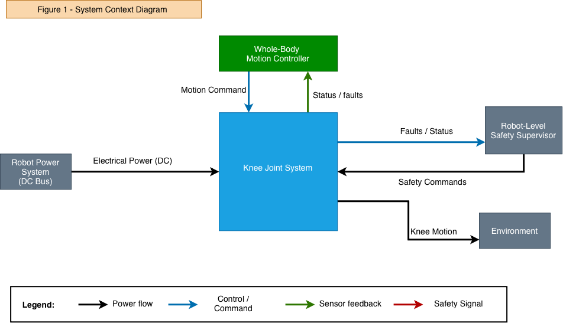

# 1. System Definition

## 1.1 Purpose

This project looks at one load-bearing knee joint of an industrial humanoid robot.

The joint has to convert a motion or torque request from the robot controller into controlled knee movement, while still being able to detect local faults and react before they develop into hazardous motion.

The aim is not to design the complete humanoid robot, but to understand how requirements, architecture, diagnostics and fault reactions can be built around one safety-critical actuator.

## 1.2 System Boundary

The system under consideration is the complete local knee-joint actuation chain.

Included inside the boundary:

- Communication interface
- Local joint controller
- Motor-control function
- Gate driver
- Three-phase inverter
- PMSM motor
- Reduction gearbox / transmission
- Motor encoder
- Joint-output encoder
- Motor-current sensing
- Voltage and temperature monitoring
- Local safety monitoring
- Independent torque-disable path
- Optional joint brake

The physical joint output is included because the safety concern is not only what the electronics command, but what the knee actually does.

## 1.3 External Systems

The knee system interacts with the following robot-level systems.

Whole-Body Motion Controller. Provides the requested joint behavior, for example desired joint position, velocity, torque, operating mode and enable / disable request. It is outside the knee system boundary because it coordinates the complete robot rather than only the knee.

Robot Safety Supervisor. Coordinates robot-level reactions such as controlled stop, degraded operation, posture recovery and higher-level power isolation. The knee system reports fault and health status to this supervisor.

Robot Power System. Provides the actuator DC supply. For this demonstrator, a nominal actuator DC bus of approximately 48 V is assumed.

Robot Mechanical Structure and Environment. The knee is connected to the thigh and lower leg and is influenced by robot weight, payload, inertia, ground-reaction forces, disturbances from other joints and contact with the environment. These loads are treated as external inputs to the knee system.

## 1.4 Main Inputs

The knee system receives:

- Desired joint position
- Desired joint velocity
- Desired joint torque
- Mode / enable command
- DC electrical power
- Mechanical load at the joint
- Robot-level safety requests

Local sensor feedback is treated as an internal input to the control and safety functions.

## 1.5 Main Outputs

The system produces:

- Knee joint torque
- Knee joint angular motion
- Actual joint position and velocity
- Actuator status
- Diagnostic information
- Detected fault status
- Degraded / safe-state status

## 1.6 Functional Chain

The nominal control path is:

`Whole-Body Controller -> Communication Interface -> Local Joint Controller -> Motor Control -> Gate Driver -> 3-Phase Inverter -> PMSM Motor -> Gearbox -> Knee Joint Output`

The corresponding energy path is:

`Robot Power System -> DC Bus -> Inverter -> Motor -> Gearbox -> Knee Joint`

The feedback path includes the motor encoder, joint encoder, current sensing, voltage sensing and temperature sensing. These signals are used by both the normal control path and the safety-monitoring path.

## 1.7 Operating Scenario Used in This Project

The reference scenario is a humanoid walking slowly near a person while carrying a load. The knee is load-bearing and contributes to maintaining posture and controlled forward motion.

A fault causes the knee to move faster than intended or produce unintended / excessive torque. Possible consequences include:

- Loss of controlled walking
- Collision with the nearby person
- Loss of balance or robot fall
- Dropped or destabilised payload
- Damage to the robot or nearby equipment

This scenario is used throughout the hazard analysis, FMEA, FTA and verification concept.

## 1.8 Important Safety Assumption

Immediate torque removal is not assumed to be safe by default.

`Torque-off -> loss of joint support -> possible collapse`

## 1.9 Initial Design Assumptions

1. The actuator uses a PMSM motor and a three-phase inverter.
2. A mechanical reduction stage is present between the motor and the knee output.
3. Motor position and joint-output position are measured separately.
4. Motor current is measured and available for control and diagnostics.
5. The local knee controller cannot assume that commands from the whole-body controller are always correct.
6. The safety-monitoring function should not rely completely on the same control path that may create the hazardous behavior.
7. A single sensor fault should not automatically result in unrestricted actuator operation.
8. Mechanical faults remain part of the safety analysis even if they cannot be fully mitigated electronically.

## 1.10 Out of Scope

The following are not developed in detail:

- Complete humanoid balance control
- Gait planning
- Perception / AI safety
- Battery-pack safety
- Full robot structural analysis
- Cybersecurity
- Complete brake design
- Full certification assessment
- Detailed motor electromagnetic design

These may appear as external interfaces or assumptions, but they are not the focus of this demonstrator.
