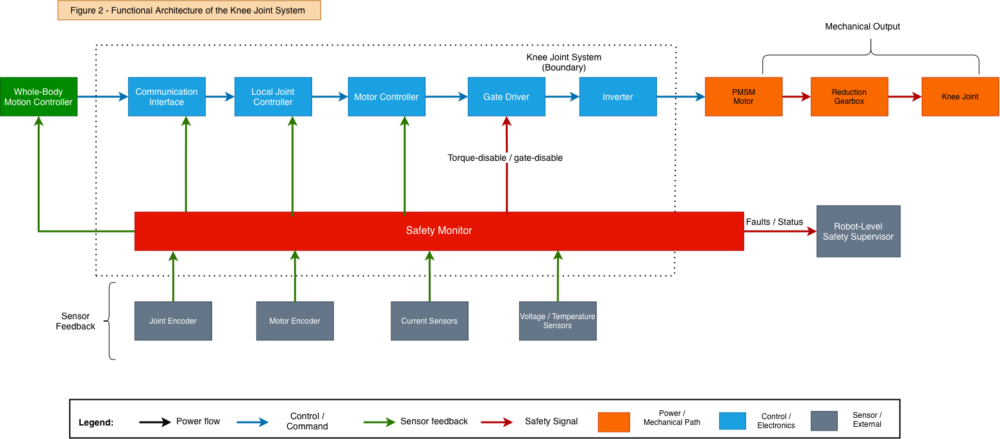
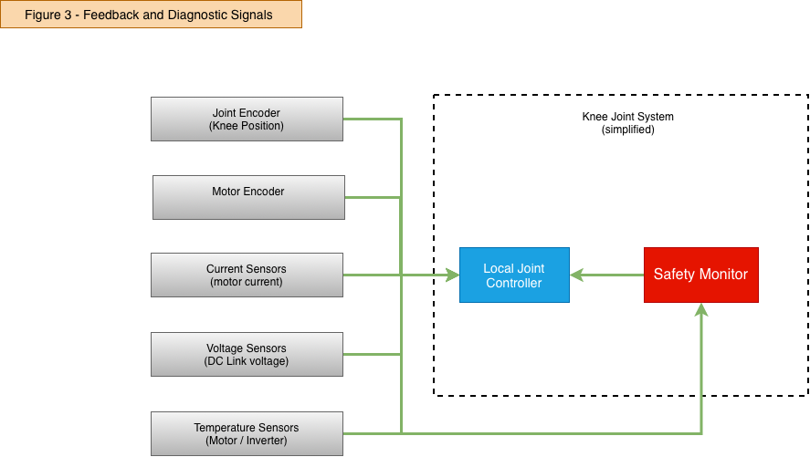

# 2. System Architecture

## 2.1 Architecture Objective

The knee-joint architecture was developed around one main safety concern: unintended or excessive knee torque or motion while the joint is load-bearing.

The architecture therefore needs to support both normal closed-loop actuator control and local detection of abnormal behaviour. A key consideration is that the same control path that produces joint torque should not be the only path available to detect and mitigate hazardous torque.

The architecture is intentionally limited to the level required for this demonstrator. Detailed circuit design, processor selection, motor electromagnetic design and production-level redundancy concepts are outside the current scope.

## 2.2 Architecture Overview

The joint is split conceptually into four main paths:

- command and control
- electrical and mechanical energy flow
- sensor feedback and diagnostics
- safety monitoring and fault reaction

Separating these paths helped make the safety reasoning clearer.

The command path determines what the actuator is requested to do.

The energy path is the physical path through which electrical energy becomes joint torque and motion.

The feedback path provides information about what the actuator is actually doing.

The safety path checks whether commanded and actual behaviour remain consistent and provides a means to react when they do not.

## 2.3 Command and Control Path

The normal command path is:

`Whole-Body Motion Controller → Communication Interface → Local Joint Controller → Motor Controller → Gate Driver → Inverter`

The Whole-Body Motion Controller provides joint-level motion intent.

The Local Joint Controller executes this request subject to local limits and diagnostics.

Motor Control / FOC regulates motor current and generates PWM for the inverter.

Allocation decision: whole-body motion planning remains at robot level, while fast actuator execution and monitoring remain local to the knee.

## 2.4 Energy and Mechanical Actuation Path

The physical energy path is:

`Robot Power System → DC Bus → Three-Phase Inverter → PMSM Motor → Reduction Gearbox → Knee Joint`

This is the physical hazard-propagation path. Faults in the power stage or transmission can cause joint behaviour to differ from the software request, so safety monitoring cannot rely only on command signals.

## 2.5 Feedback and Diagnostic Path

The baseline architecture uses feedback from several points in the actuator.

| Signal | Used by | Architectural purpose |
| --- | --- | --- |
| Joint encoder | Local Controller, Safety Monitor | Actual knee motion |
| Motor encoder | Motor Control, Safety Monitor | Rotor state + motor-side motion |
| Motor current | Motor Control, Safety Monitor | Electrical actuation / torque indication |
| Voltage / temperature | Controller, Safety Monitor | Operating-condition supervision |

## 2.6 Cross-Monitoring Concept

The architecture uses measurements from different physical points to check whether the actuator behaves consistently.

One example is the relationship between motor-side and joint-side motion:

`Motor Encoder ↔ expected gearbox relationship ↔ Joint Encoder`

If the motor moves but the knee output does not follow the expected transmission relationship, the actuator state is inconsistent.

Possible causes include:

- gearbox or coupling fault
- motor encoder fault
- joint encoder fault
- incorrect scaling or configuration

The purpose of this check is not necessarily to identify the exact failed component immediately. The first objective is to detect that the measured actuator behaviour is no longer physically plausible.

A similar check is used in the electrical path:

`Commanded Motor Current ↔ Measured Motor Current`

A persistent difference indicates that the motor-current path is not following the requested actuation.

## 2.7 Safety Monitor

The architecture includes a Safety Monitor that observes selected safety-relevant relationships independently of the primary motion-control objective.

Relevant inputs include:

- commanded and measured joint velocity
- commanded and measured motor current
- motor encoder
- joint encoder
- communication status
- voltage and temperature status

The main monitoring functions are:

- joint-velocity deviation monitoring
- motor-current deviation monitoring
- motor-to-joint transmission plausibility
- communication supervision
- sensor plausibility
- controller/timing supervision

The Safety Monitor is not intended to be a duplicate joint controller.

Its purpose is to reduce the risk that a single fault in the normal control path can both create hazardous behaviour and prevent that behaviour from being detected.

The detailed implementation and required independence of this monitor are left open at this stage.

## 2.8 Independent Fault-Reaction Path

The architecture includes an independent torque-disable or gate-disable path.

This is needed because the normal controller itself may be the source of the fault.

For example:

`Local Joint Controller Fault → incorrect current request → hazardous motor torque`

If the same faulty controller is also the only means of stopping the motor, the architecture contains a single dependency.

The safety concept therefore assumes a separate hardware-capable path that can influence torque generation without relying completely on the normal control software.

The detailed implementation of this path is not fixed in this demonstrator.

## 2.9 Robot-Level Safety Supervisor

Local actuator faults are reported to a robot-level Safety Supervisor.

The local knee system is responsible for detecting actuator-level problems, while the robot-level supervisor coordinates actions involving the complete humanoid, such as:

- posture recovery
- coordinated stopping
- degraded whole-body operation
- higher-level power isolation

This split is intentional. The knee controller has the fastest access to local actuator information, but it does not have enough information to determine the safest response for the complete robot.

## 2.10 Fault-Reaction Philosophy

The architecture does not assume that every fault should result in immediate torque removal.

For a load-bearing knee, removing torque abruptly may cause loss of support and robot collapse.

The fault reaction therefore depends on which functions remain trustworthy after the fault.

If normal control is still considered reliable, the preferred response may be:

- torque limitation
- velocity limitation
- degraded operation
- controlled stop

If normal control can no longer be trusted, the reaction may require:

- independent torque disable
- power isolation
- mechanical brake
- coordinated robot-level recovery

The guiding principle is:

Use the least disruptive reaction that still provides a trustworthy means of controlling the hazard.

## 2.11 Key Architecture Decisions

The following decisions were made during development of the demonstrator.

Whole-body control remains outside the knee system boundary.

The whole-body controller coordinates the complete robot, while the knee system is responsible for local execution and monitoring.

Motor-side and joint-side position are measured separately.

This provides information on both sides of the gearbox and supports transmission plausibility monitoring.

Motor current is treated as safety-relevant feedback.

It provides information about the electrical torque-generation path and allows commanded-versus-actual actuation to be monitored.

Safety monitoring is separated conceptually from normal control.

The objective is to avoid a single control-path failure defeating both control and fault mitigation.

Immediate torque-off is not treated as the universal safe state.

The knee may be supporting robot weight, so fault reaction depends on remaining control capability.

Mechanical failures remain inside the safety analysis.

An electrical safety concept alone cannot guarantee correct joint behaviour if the gearbox or coupling fails.

## 2.12 Assumptions and Open Points

The following points are assumptions for the current demonstrator and would require further engineering work in a real design:

PMSM and three-phase inverter are assumed as the actuator technology.

Approximately 48 V is used as a representative actuator DC bus, not as a derived requirement.

The exact implementation and independence of the Safety Monitor are not yet defined.

The exact design of the independent torque-disable path is not specified.

Mechanical brake implementation remains optional.

Exact diagnostic thresholds and reaction times are not yet derived.

Sensor accuracy, diagnostic coverage and quantitative reliability targets are not calculated.

Detailed common-cause and dependent-failure analysis remains future work.

These open points are kept explicit so that the architecture is not presented as more mature than it currently is.
