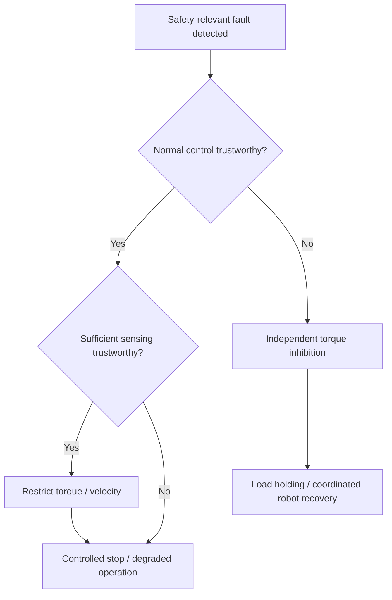

# 6. Safety Concept, Traceability and Verification

## 6.1 Purpose

This section defines the fault-reaction concept and links the safety requirements to architecture and verification.

The safety focus remains:

**HE-01 — Hazardous unintended knee motion while the joint is load-bearing.**

The concept traces back to SG-01 and FSR-01 to FSR-12.

## 6.2 Safety Concept and Fault-Reaction Logic

The required reaction depends on which parts of the actuator remain trustworthy after a fault.

If normal control and sufficient sensing remain trustworthy, the system can use controlled torque or velocity limitation and move toward a controlled stop.

If the normal control path can no longer be trusted, the reaction must use a mechanism that does not depend solely on that path.

For a load-bearing knee, torque inhibition alone may remove joint support. The final reaction may therefore also require load holding or coordinated robot-level support.

## 6.3 Fault-Reaction Matrix

| Detected condition | Trusted capability | Reaction | Related drive-safety concept* |
| --- | --- | --- | --- |
| Communication unavailable / invalid | Local control and sensing healthy | Reject invalid commands and perform controlled stop | SS1-like |
| Safety-relevant sensor fault | Sufficient sensing and controller healthy | Restrict torque / velocity; degraded operation or controlled stop | SLS / SS1-like |
| Absolute safety envelope exceeded | Safety Monitor and reaction path healthy | Limit motion or initiate controlled stop | SLS / SS1-like |
| Joint motion / transmission inconsistency | Controller responsive; mechanical state uncertain | Torque limitation, controlled stop and robot-level recovery | SS1-like |
| Local joint controller untrusted | Independent safety path healthy | Independent torque inhibition followed by load-holding / robot-level reaction | STO + holding function |
| Gate driver / inverter untrusted | Independent inhibition / isolation available | Inhibit torque generation, isolate where required and coordinate load holding | STO-like |
| Safety path unavailable | Normal control healthy but protection degraded | Prevent unrestricted operation; perform controlled stop if already operating | — |

\*The IEC 61800-5-2 terms are used here only as a conceptual mapping. The demonstrator does not claim implementation or certification of these safety functions.

## 6.4 Independent Safety Path

The normal controller may itself be the source of hazardous torque.

The architecture therefore includes a hardware-capable path that can inhibit torque generation without relying solely on the normal control software.

The safety path must also be supervised. Relevant mechanisms may include:

- startup self-test
- watchdog supervision
- command / feedback monitoring of the inhibit path
- periodic diagnostic or proof testing where applicable

Common dependencies such as shared power, clock, processor resources and gate-control circuitry must be considered during detailed design.

Torque inhibition and load holding are treated as separate functions. Removing motor torque does not automatically guarantee that a load-bearing knee remains mechanically supported.

## 6.5 Requirements-to-Architecture Traceability

HE-01 and SG-01 apply to all requirements below.

| FSR | Architecture Element | Safety Mechanism | V&V Ref |
| --- | --- | --- | --- |
| FSR-01 | Joint Encoder + Safety Monitor | Velocity-deviation monitoring | VVT-01 |
| FSR-02 | Safety Monitor + Local Control | Reaction to excessive velocity deviation | VVT-01 |
| FSR-03 | Safety Monitor + Communication Interface | Fault / degraded-state reporting | VVT-07 |
| FSR-04 | Current Sensors + Safety Monitor | Current-deviation monitoring | VVT-02 |
| FSR-05 | Safety Monitor + Reaction Path | Reaction to excessive current deviation | VVT-02 |
| FSR-06 | Motor Encoder + Joint Encoder | Transmission plausibility monitoring | VVT-03 |
| FSR-07 | Communication Interface | Timeout / integrity supervision | VVT-04 |
| FSR-08 | Local Controller + Safety Monitor | Invalid-command rejection and fault reaction | VVT-04 |
| FSR-09 | Independent Torque-Inhibit Path | Independent inhibition of hazardous torque | VVT-06 |
| FSR-10 | Sensors + Safety Monitor | Sensor plausibility and degraded reaction | VVT-05 |
| FSR-11 | Safety Monitor | Absolute velocity / position / torque-related limits | VVT-08 |
| FSR-12 | Safety Monitor + Independent Safety Path | Safety-mechanism diagnostics | VVT-09 |

## 6.6 Verification Strategy

Verification is planned at several levels.

**SiL** is used for monitoring logic, state-machine behaviour and fault injection.

**HiL** is used for controller, communication, sensor and reaction-path faults with representative real-time behaviour.

**Actuator bench testing** is used to verify behaviour of the motor, inverter, sensors and physical torque-reaction path.

**Integration testing** checks interaction between the knee system and the Robot Safety Supervisor.

Analysis is used for reaction-time budgeting, independence and common-cause assumptions.

## 6.7 V&V Matrix

| V&V ID | Verification objective | Requirements | Method | Pass concept |
| --- | --- | --- | --- | --- |
| VVT-01 | Velocity-deviation detection and reaction | FSR-01, FSR-02 | SiL / HiL fault injection | Inject velocity deviation above `V_DEV_MAX`; detect after the defined persistence time and initiate reaction within `T_REACT_MAX`. |
| VVT-02 | Motor-current monitoring and reaction | FSR-04, FSR-05 | HiL / bench test | Inject current deviation above `I_DEV_MAX`; detect and initiate the required reaction within the defined timing limit. |
| VVT-03 | Transmission plausibility | FSR-06 | SiL / HiL | Inject encoder offset or simulated transmission mismatch; detect behaviour outside the permitted plausibility range. |
| VVT-04 | Communication supervision | FSR-07, FSR-08 | Communication fault injection | Drop, delay, repeat or corrupt commands; detect invalid communication and prevent unrestricted operation. |
| VVT-05 | Sensor fault handling | FSR-10 | SiL / HiL fault injection | Freeze, offset or remove safety-relevant sensor signals; detect the fault and enter the specified restricted reaction. |
| VVT-06 | Independent torque-inhibit path | FSR-09 | HiL / integration | Fault the normal controller while hazardous torque is requested; verify the independent path can still inhibit torque generation. |
| VVT-07 | Fault reporting | FSR-03 | Integration test | Inject representative faults and verify the expected fault / degraded-state information reaches the Robot Safety Supervisor. |
| VVT-08 | Absolute safety-envelope monitoring | FSR-11 | SiL / HiL | Command behaviour outside the permitted velocity, position or torque-related envelope while actuator tracking remains correct; verify independent detection and reaction. |
| VVT-09 | Safety-mechanism supervision | FSR-12 | HiL / diagnostic test | Disable or fault the Safety Monitor / torque-inhibit path and verify that unrestricted operation is prevented. |
| VVT-10 | Safety reaction timing | FSR-02, FSR-05, FSR-08, FSR-11 | SiL / HiL / bench measurement | Measure detection and reaction times and verify the total response remains within the derived hazard-response time. |

## 6.8 Reaction-Time Verification

The safety timing budget is:

`T_DETECT + T_DECIDE + T_ACTUATE + T_PHYSICAL < T_HAZARD`

where:

- `T_DETECT` — fault-detection time
- `T_DECIDE` — safety logic processing time
- `T_ACTUATE` — safety mechanism response time
- `T_PHYSICAL` — physical actuator response
- `T_HAZARD` — available time before hazardous motion occurs

The numerical timing budget is not yet fixed and will be derived using simulation and actuator testing.

## 6.9 Planned Fault-Injection Demonstration

A small simulation will demonstrate the difference between deviation monitoring and independent safety-envelope monitoring.

Three cases are planned:

1. Normal command and normal actuator response.
2. Actuator response deviates from the commanded velocity.
3. An unsafe velocity command is executed correctly by the actuator.

Case 3 is important because commanded-versus-measured deviation may remain close to zero even though the physical motion exceeds the permitted safety envelope.

The simulation will record:

- fault-injection time
- detection time
- safety-reaction time
- measured joint velocity
- monitor status

This provides initial verification evidence for FSR-01, FSR-02 and FSR-11.

## 6.10 Open Points and Limitations

Open points include:

- numerical safety-envelope limits
- diagnostic persistence times
- complete reaction-time budget
- required Safety Monitor independence
- detailed torque-inhibit hardware
- load-holding / brake implementation and sizing
- sensor independence and diversity
- quantitative diagnostic coverage
- common-cause failure analysis
- achieved ISO 13849 architecture category / PL
- quantitative reliability analysisn.

Quantitative reliability, diagnostic coverage and common-cause analysis are outside the current demonstrator scope.

Verification activities are planned; physical test evidence has not yet been generated.
