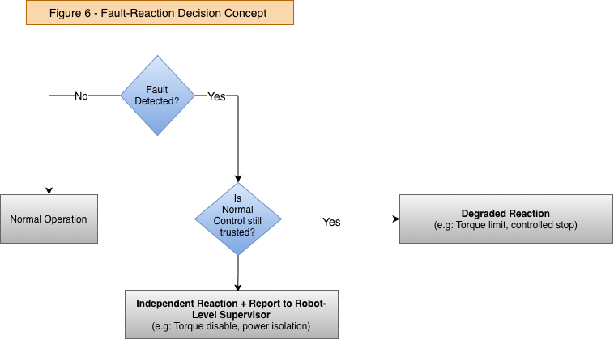

# 6. Safety Concept, Traceability and Verification

## 6.1 Purpose

This section defines the fault-reaction concept and links the safety requirements to architecture and verification.

Safety focus: HE-01 - hazardous unintended knee motion while the joint is load-bearing. All concepts below trace back to SG-01 and the ten FSRs defined earlier.

## 6.2 Safety Concept and Fault-Reaction Logic

The safety concept is based on the amount of control capability that remains trustworthy after a fault. A communication fault, sensor fault and inverter fault therefore do not automatically result in the same reaction.

If local control and sensing remain trustworthy, the preferred response is to restrict capability and move toward a controlled stop. If the normal control or torque-generation path can no longer be trusted, the reaction must use an independent mechanism.

Immediate torque-off is not treated as the default response because loss of knee support may itself destabilise the robot.

## 6.3 Fault-Reaction Matrix

| Detected condition | Trusted capability | Reaction |
| --- | --- | --- |
| Communication unavailable / invalid | Local control and sensing healthy | Controlled stop, then local hold / degraded state |
| Safety-relevant sensor fault | Remaining sensing and controller healthy | Restrict torque/velocity; degraded mode or controlled stop |
| Joint motion / transmission inconsistency | Control responsive, mechanical state uncertain | Torque limitation + controlled stop / robot-level recovery |
| Local joint controller untrusted | Independent safety path healthy | Independent torque disable |
| Gate driver / inverter untrusted | Safety monitor and independent isolation healthy | Gate disable / power isolation + coordinated recovery |
| Safety path itself unavailable | Normal control healthy but protection degraded | Prevent unrestricted operation and perform controlled robot-level stop |

## 6.4 Independent Safety Path

The normal controller may itself be the source of hazardous torque. The architecture therefore includes a hardware-capable reaction path that can inhibit torque generation without relying solely on the normal control software.

The final implementation must address common dependencies such as shared power, processor, clock and gate-control resources.

## 6.5 Requirements-to-Architecture Traceability

The table below shows how each functional safety requirement is implemented conceptually in the architecture and how it will be verified. HE-01 / SG-01 apply to all rows.

| FSR | Architecture Element | Safety Mechanism | V&V Ref |
| --- | --- | --- | --- |
| FSR-01 | Joint Encoder + Safety Monitor | Velocity-deviation monitoring | VVT-01 |
| FSR-02 | Safety Monitor + Motor Control | Torque/velocity limitation | VVT-01 |
| FSR-03 | Safety Monitor + Communication Interface | Fault-status reporting | VVT-07 |
| FSR-04 | Current Sensors + Safety Monitor | Current-deviation monitoring | VVT-02 |
| FSR-05 | Safety Monitor + Gate/Disable Path | Current limitation / torque inhibit | VVT-02 |
| FSR-06 | Motor Encoder + Joint Encoder | Transmission plausibility | VVT-03 |
| FSR-07 | Communication Interface | Timeout / integrity supervision | VVT-04 |
| FSR-08 | Local Controller + Safety Monitor | Invalid-command rejection / controlled reaction | VVT-04 |
| FSR-09 | Independent Torque-Disable Path | Independent torque inhibit | VVT-06 |
| FSR-10 | Sensors + Safety Monitor | Sensor plausibility / degraded reaction | VVT-05 |

## 6.6 Verification Strategy

Verification is planned progressively. SiL/HiL testing is used for diagnostic logic and fault injection; actuator bench testing covers the real motor, inverter and sensors; integration testing covers interaction with the robot-level safety supervisor. Analysis is used for timing, independence and common-cause assumptions

## 6.7 V&V Matrix

| V&V ID | Verification objective | Requirements | Method | Pass concept |
| --- | --- | --- | --- | --- |
| VVT-01 | Joint velocity deviation monitoring and reaction | FSR-01, FSR-02 | SIL / HIL fault injection | Inject excessive commanded-vs-measured velocity deviation; detect and initiate defined reaction within required time. |
| VVT-02 | Motor current monitoring and reaction | FSR-04, FSR-05 | HIL / bench test | Inject incorrect current feedback or emulate overcurrent; detect and limit / disable as defined. |
| VVT-03 | Motor-to-joint transmission plausibility | FSR-06 | SIL / HIL | Inject encoder offset or simulated gearbox slip; detect mismatch above allowable tolerance. |
| VVT-04 | Communication supervision and reaction | FSR-07, FSR-08 | Communication fault injection | Drop, delay, repeat and corrupt commands; reject invalid data and enter defined reaction. |
| VVT-05 | Sensor fault handling | FSR-10 | SIL / HIL fault injection | Freeze, offset or remove safety-relevant sensor signals; prevent unrestricted actuator operation. |
| VVT-06 | Independent safety reaction path | FSR-09 | HIL / integration | Force a main-controller fault while hazardous torque is requested; verify independent path still inhibits torque. |
| VVT-07 | Fault reporting to robot safety supervisor | FSR-03 | Integration test | Inject representative safety faults; verify correct fault/status message arrives within required reporting time. |

## 6.8 Open Points and Limitations

Diagnostic thresholds, persistence times and reaction-time budgets still need quantitative derivation.

Safety Monitor independence and the torque-disable implementation require detailed hardware/software design.

Quantitative reliability, diagnostic coverage and common-cause analysis are outside the current demonstrator scope.

Verification activities are planned; physical test evidence has not yet been generated.
